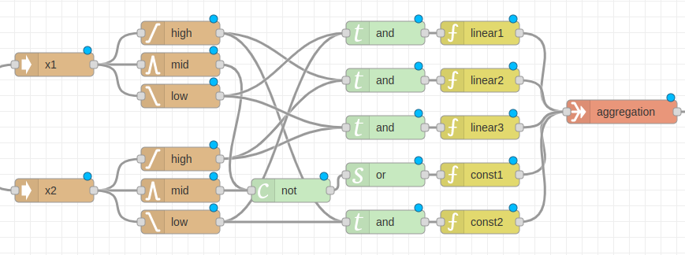
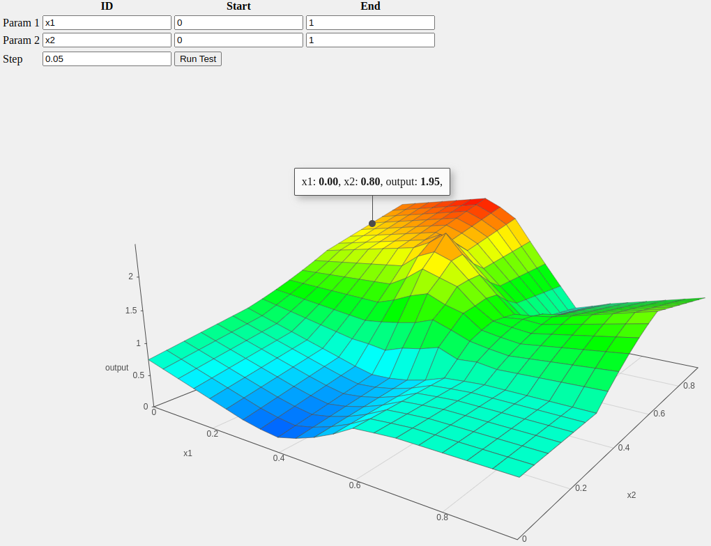

# node-red-contrib-fuzzy

### Event-driven Takagi-Sugeno Fuzzy Inference System implementation for Node-RED

This repository contains an implementation of event-driven control network based Takagi-Sugeno Fuzzy Inference System in Node-RED. The Node-RED implementation based on the idea that the Takagi-Sugeno Fuzzy Inference System can be represented as a network-like model and implemented as a event driven control network. For furhter information please find the  [publication](https://www.researchgate.net/publication/342054388_Event-driven_Fuzzy_Inference_System_Implementation_in_Node-RED) on ResearchGate.

##  Quick Start

1. Install **node-red-contrib-fuzzy** package via [Palette Manager](https://nodered.org/docs/user-guide/editor/palette/manager)
2. [Import](https://nodered.org/docs/user-guide/editor/workspace/import-export)  the test flow [test/flow.js](./test/flow.js) template and modify

3. Create a test plot surface with [test/surface/plot.html](./test/surface/plot.html) using WebSockets


## Nodes
The nodes provided by this package can be used to implement an event driven TS-FIS. 

### Input node 

The input nodes prepares a message with a data structure from the input crisp values for the membership functions. The data structure of each input nodes contains a unique identifier and the crisp value. This
identifier used to identify the inputs for consequent nodes to calculate the outputs. The presence of the input crisp value in the data structure is required by the first order TS-FIS output value calculation in consequent nodes. In the case of only zero order TS-FIS outputs the input crisp values can be eliminated and simplify the input node. 
The Input node  receive values as msg.payload and the ID should be set in the node configuration.

### Membership function nodes

Membership function nodes carry out a fuzzy partition of the input space. The fuzzy membership function node from the incoming messages calculates the fuzzy set value (µ<sub>xi</sub>) from the crisp value (x<sub>i</sub>). In event-driven fuzzy system entities that implement membership functions generate fuzzy set values (µ<sub>xi</sub>) on the output of the messages when receive message into the input queue. 
The nodes can be easily configured by setting the breaking point paramters according to the membership function.
Implemented memberhip functions:
- Grade
- Reverse Grade
- Triangle
- Trapezoid


### Fuzzy operators-Antecedent
In event-driven FIS network the implication is formed from the antecedence as the fuzzy operator and the applied consequences as output functions. The node needs an internal memory to store the last value of inputs fuzzy set values in records. The internal memory updates the records when receive new fuzzy set value change. The fuzzy operator node sends message after updates the ouput firing rule weight according to the applied triangular norm. The output messages contains the firing weight and the crisp input value. The outgoing message is containes the weight of the firing rule (w<sub>i</sub>) and the list of the updated input crisp values (x<sub>i</sub>).

- and: T-norm min(µ<sub>x1</sub>,µ<sub>x2</sub>,µ<sub>x3</sub>,...)
- or: S-norm max(µ<sub>x1</sub>,µ<sub>x2</sub>,µ<sub>x3</sub>,...)
- not:Complement (1-µ)

### Implication - Consequent

The implication for the Takagi-Sugeno FIS has zero and first order consequent output functions. The consequent
node calculates the output value by input crisp values and the predefined coefficients. The output message of the consequent node contains the crisp function value (z<sub>i</sub>), the firing weight (w<sub>i</sub>) and the node identifier for aggregating the output. Implication function can be defined as adding variables with a coefficient and a constant value.

### Aggregation
The aggregation node is calculating the final output of the event-driven FIS network from the weighted average of the aggregation of all the singletons. The aggregation node sends an output message when receive an input message.
The output msg.payload contains the output value and the input values too e.g.:
```json
{
  "output": 1.25,
  "input": [
    {
      "id": "x1",
      "value": 1
    },
    {
      "id": "x2",
      "value": 1
    }
  ]
}
```

